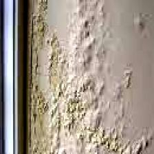
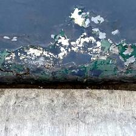
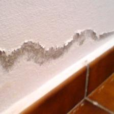
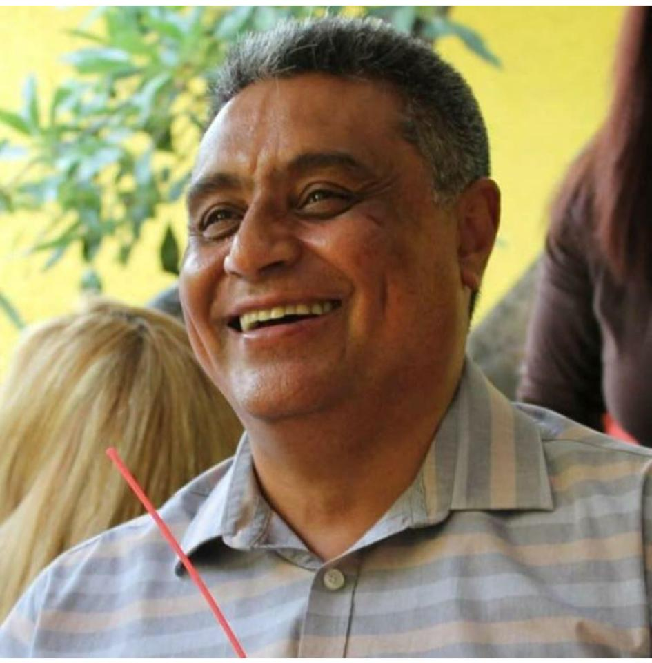

# 🏗️ SaltSpot Dataset: Salt Damage Detection in Concrete Structures 🏛️  

## 📋 Table of Contents
- [Overview](#-overview)
- [Key Features](#-key-features)
- [Dataset Structure](#-dataset-structure)
- [Usage](#-usage)
- [Applications](#-applications)
- [Supported Frameworks](#-supported-frameworks)
- [Research Team](#-research-team)
- [Citation](#-citation)
- [License](#-license)
- [Contact](#-contact)

## 📌 Overview  

The **SaltSpot dataset** is a collection of **1,542 images** 📸 of concrete surfaces, specifically designed for **deep learning applications in civil engineering**. This dataset enables **automated detection** of **salt damage** 🧂 on concrete structures using **computer vision techniques**.  

This dataset was used in the research:  
📄 *"SaltSpot: A Convolutional Neural Network Approach for Classifying Salt Contamination Damage on Civil Infrastructure"*.  
If you use this dataset in your research, please **cite our work** (see **Citation** section below).  

---

## ✨ Key Features

- **📸 High-Quality Imagery**: 1,542 high-resolution images preprocessed to 224x224 pixels.
- **🏷️ Expertly Labeled**: Binary classification (Healthy vs. Salt Damaged) verified by civil engineering experts.
- **🏗️ Real-World Scenarios**: Captures diverse concrete textures, lighting conditions, and degradation levels.
- **🧠 Ready for AI**: Formatted and organized specifically for CNN training (ResNet, VGG, MobileNet).

---

## 📂 Dataset Structure  

The dataset is divided into two **main classes**:  

- ✅ **Class 0 - •	Healthy structure:** Concrete surfaces without visible contamination or deterioration.  
- ❌ **Class 1 - •	Structure with salt damage:** Concrete surfaces with visible salt-related deterioration, including **spalling, scaling, discoloration, and crystal deposits**.  

### **📁 Folder Organization:**  
SaltSpot_Dataset/

│── train/ │ 

    ├── Class_0/ (Healthy Structures) │
  
    ├── Class_1/ (Salt Damaged Structures) │ 

│── valid/ │

    ├── Class_0/ (Healthy Structures) │
  
    ├── Class_1/ (Salt Damaged Structures) │

│── test/ │

    ├── Class_0/ (Healthy Structures) │ 
    
    ├── Class_1/ (Salt Damaged Structures) │

📌 **Images are in `.jpg` format** and have been preprocessed to **224x224 pixels** for deep learning applications.
---

## 🛠️ Usage

### **📥 Downloading the Dataset**
To download this dataset, clone this repository using:

    git clone https://github.com/yourusername/SaltSpot.git

Alternatively, you can download the dataset manually from the __Releases__ section.

## 📊 Applications

---
🔍 The SaltSpot dataset is intended for machine learning and deep learning applications, including:

- Binary Classification of salt-damaged vs. non-damaged structures 🏚️.
- Transfer Learning using pre-trained CNN models like ResNet50, VGG16, and MobileNet 🧠.
- Data Augmentation & Preprocessing techniques for improving model generalization.
- Structural Health Monitoring (SHM) applications in civil engineering 🏗️.

## 🛠️ Supported Frameworks

| :package: Framework | :rocket: Usage |
|:---:|:---:|
|  | **Deep Learning Model Training** |
|  | **Model Deployment & TFLite** |
|  | **Rapid Prototyping** |
|  | **Image Preprocessing** |

## 🧑‍🔬 Research Team

### 🌟 Meet the Team
*Researchers advancing civil engineering and computational methods*

### 👥 Main Researchers

<table align="center">
  <thead>
    <tr>
      <th align="center" width="120">Photo</th>
      <th align="left">Researcher</th>
      <th align="left">Affiliation</th>
      <th align="left">Contact</th>
    </tr>
  </thead>
  <tbody>
    <tr>
      <td align="center" width="120">
        
      </td>
      <td>
        <b>Dr. José Alberto Guzmán Torres</b> :mexico: 
        Engineering Applications &amp; Artificial Intelligence
      </td>
      <td>
         
        
      </td>
      <td>
         
         
        
      </td>
    </tr>
    <tr>
      <td align="center" width="120">
        
      </td>
      <td>
        <b>Dr. Francisco Javier Domínguez Mota</b> :mexico: 
        Applied Mathematics &amp; Finite Difference Methods
      </td>
      <td>
         
        
      </td>
      <td>
         
         
        
      </td>
    </tr>
    <tr>
      <td align="center" width="120">
        
      </td>
      <td>
        <b>Dra. Elia M. Alonso Guzmán</b> :mexico: 
        Civil Engineering &amp; Materials Science
      </td>
      <td>
        
      </td>
      <td>
         
         
        
      </td>
    </tr>
    <tr>
      <td align="center" width="120">
        
      </td>
      <td>
        <b>Dr. Gerardo Tinoco Guerrero</b> :mexico: 
        Numerical Methods &amp; Computational Mathematics
      </td>
      <td>
         
        
      </td>
      <td>
         
         
        
      </td>
    </tr>
    <tr>
      <td align="center" width="120">
        
      </td>
      <td>
        <b>Dr. José Gerardo Tinoco Ruíz</b> :mexico: 
        Applied Mathematics &amp; Computational Modeling
      </td>
      <td>
        
      </td>
      <td>
         
         
        
      </td>
    </tr>
    <tr>
      <td align="center" width="120">
        
      </td>
      <td>
        <b>Dr. Heriberto Árias Rojas</b> :mexico: 
        Engineering Applications
      </td>
      <td>
         
        
      </td>
      <td>
         
         
        
      </td>
    </tr>
  </tbody>
</table>

## 🏆 Citation

If you use this dataset in your research or project, please cite the following papers:

@article{guzman2025digital, <be>
  title={A digital twin approach based method in civil engineering for classification of salt damage in building evaluation},  
  author={Guzmán-Torres, JA and Domínguez-Mota, FJ and Guzmán, Elia M Alonso and Tinoco-Guerrero, G and Tinoco-Ruíz, JG},  
  journal   = {Mathematics and Computers in Simulation},  
  year      = {2025},  
  volume    = {233},  
  pages     = {433-447},  
  doi       = {https://doi.org/10.1016/j.matcom.2025.02.003 }  
}

## ⚖️ License

This dataset is released under the MIT License. You are free to use, modify, and distribute it, but please credit the *authors* appropriately.  
*MIT License © 2025 J. A. Guzmán-Torres et al.*

## 📩 Contact
For any questions or issues, please open an issue 🔗 in this repository or contact:

📢 J. A. Guzmán-Torres - Lead Researcher  
✉️ Email: jose.alberto.guzman@umich.mx.com  
🏛 Institution: Universidad Michoacana de San Nicolás de Hidalgo
