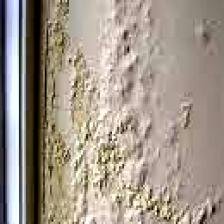
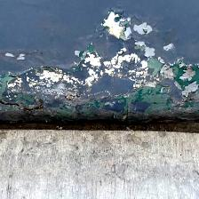
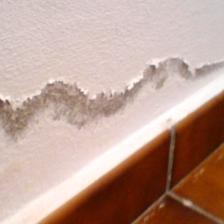
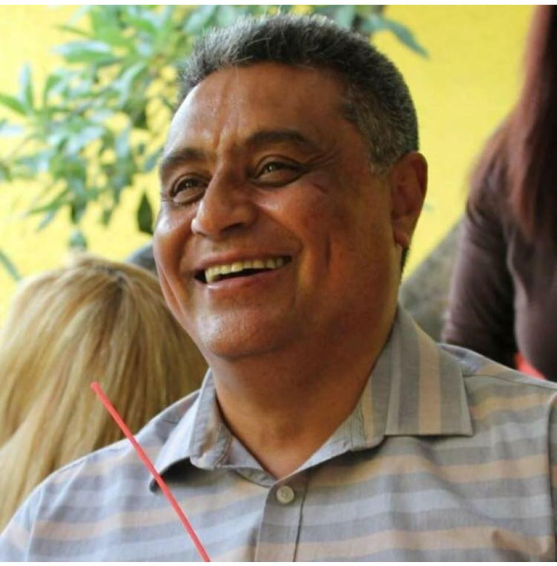

# 🏗️ SaltSpot Dataset: Salt Damage Detection in Concrete Structures 🏛️  

<div align="center">
  
  
  
</div>
<br/>

<div align="center">

[](https://opensource.org/licenses/MIT)
[](#-dataset-structure)
[](#-key-features)
[](https://doi.org/10.1016/j.matcom.2025.02.003)

</div>

## 📋 Table of Contents
- [Overview](#-overview)
- [Key Features](#-key-features)
- [Dataset Structure](#-dataset-structure)
- [Usage & Code Examples](#-usage--code-examples)
- [Applications](#-applications)
- [Supported Frameworks](#-supported-frameworks)
- [Research Team](#-research-team)
- [Citation](#-citation)
- [Contributing](#-contributing)
- [License](#-license)
- [Contact](#-contact)

## 📌 Overview  

The **SaltSpot dataset** is a comprehensive collection of **1,542 high-resolution images** 📸 of concrete surfaces, specifically curated for **deep learning applications in civil engineering**. 

Salt contamination in concrete structures leads to severe deterioration, including rebar corrosion, spalling, and scaling. Traditional manual inspections are time-consuming and subjective. This dataset provides a standardized benchmark to enable the **automated detection** of **salt damage** 🧂 using modern **computer vision techniques**.

This dataset is the official companion to the research paper:  
📄 *"A digital twin approach based method in civil engineering for classification of salt damage in building evaluation"*.  
*(If you use this dataset, please refer to the [Citation](#-citation) section).*

---

## ✨ Key Features

- **📸 High-Quality Imagery**: 1,542 images preprocessed and standardized to 224x224 pixels.
- **🏷️ Expertly Labeled**: Binary classification (Healthy vs. Salt Damaged) verified by civil engineering domain experts.
- **🏗️ Real-World Scenarios**: Captures diverse concrete textures, varying lighting conditions, and different degradation levels (spalling, discoloration, crystal deposits).
- **🧠 Ready for AI**: Pre-split into Train, Validation, and Test sets, optimized for immediate CNN training (e.g., ResNet, VGG, MobileNet).

---

## 📂 Dataset Structure  

The dataset is strictly divided into two **main classes**:  

- ✅ **Class 0 (`Healthy structure`)**: Concrete surfaces without visible contamination or deterioration.  
- ❌ **Class 1 (`Structure with salt damage`)**: Concrete surfaces exhibiting visible salt-related deterioration.

### 📊 Data Distribution

| Split | Healthy Structure (Class 0) | Salt Damage (Class 1) | Total Images |
| :--- | :---: | :---: | :---: |
| **Train** | 795 | 555 | 1,350 |
| **Validation** | 75 | 53 | 128 |
| **Test** | 38 | 26 | 64 |
| **Total** | **908** | **634** | **1,542** |

### **📁 Folder Organization**  
```text
📦 Civil-damage-structure-images/
├── 📁 train/
│   ├── 📁 Healthy structure/             # 795 images
│   └── 📁 Structure with salt damage/    # 555 images
├── 📁 valid/
│   ├── 📁 Healthy structure/             # 75 images
│   └── 📁 Structure with salt damage/    # 53 images
└── 📁 test/
    ├── 📁 Healthy structure/             # 38 images
    └── 📁 Structure with salt damage/    # 26 images
```
*Note: All images are in `.jpg` format.*

---

## 🛠️ Usage & Code Examples

### **📥 System Requirements & Installation**
- **Python**: 3.8+
- **Disk Space**: ~100 MB
- **Libraries**: `torch`, `torchvision` (for PyTorch) or `tensorflow` (for TF/Keras)

Clone the repository to get started:
```bash
git clone https://github.com/yourusername/SaltSpot.git
cd SaltSpot
```

### **💻 PyTorch Dataloader Example**
Here is a quick snippet to load the dataset using PyTorch's `ImageFolder`:

```python
import torch
from torchvision import datasets, transforms
from torch.utils.data import DataLoader

# Define transformations (images are already 224x224, but normalization is recommended)
transform = transforms.Compose([
    transforms.ToTensor(),
    transforms.Normalize(mean=[0.485, 0.456, 0.406], std=[0.229, 0.224, 0.225])
])

# Load Datasets
data_dir = 'Civil-damage-structure-images'
train_dataset = datasets.ImageFolder(root=f'{data_dir}/train', transform=transform)
valid_dataset = datasets.ImageFolder(root=f'{data_dir}/valid', transform=transform)

# Create DataLoaders
train_loader = DataLoader(train_dataset, batch_size=32, shuffle=True, num_workers=2)
valid_loader = DataLoader(valid_dataset, batch_size=32, shuffle=False, num_workers=2)

print(f"Classes found: {train_dataset.classes}")
print(f"Total training batches: {len(train_loader)}")
```

### **💻 TensorFlow/Keras Example**
```python
import tensorflow as tf

data_dir = 'Civil-damage-structure-images/train'

train_ds = tf.keras.utils.image_dataset_from_directory(
  data_dir,
  validation_split=0.2,
  subset="training",
  seed=123,
  image_size=(224, 224),
  batch_size=32
)
```

## 📊 Applications

---
🔍 The SaltSpot dataset is intended for machine learning and deep learning applications, including:

- Binary Classification of salt-damaged vs. non-damaged structures 🏚️.
- Transfer Learning using pre-trained CNN models like ResNet50, VGG16, and MobileNet 🧠.
- Data Augmentation & Preprocessing techniques for improving model generalization.
- Structural Health Monitoring (SHM) applications in civil engineering 🏗️.

## 🛠️ Supported Frameworks

<div align="center">

| :package: Framework | :rocket: Usage |
|:---:|:---:|
| [](https://pytorch.org/) | **Deep Learning Model Training** |
| [](https://www.tensorflow.org/) | **Model Deployment & TFLite** |
| [](https://keras.io/) | **Rapid Prototyping** |
| [](https://opencv.org/) | **Image Preprocessing** |

</div>

## 🧑‍🔬 Research Team

<div align="center">

### 🌟 Meet the Team
*Researchers advancing civil engineering and computational methods*

</div>

### 👥 Main Researchers

<table align="center">
  <thead>
    <tr>
      <th align="center" width="120">Photo</th>
      <th align="left">Researcher</th>
      <th align="left">Affiliation</th>
      <th align="left">Contact</th>
    </tr>
  </thead>
  <tbody>
    <tr>
      <td align="center" width="120">
        
      </td>
      <td>
        <b>Dr. José Alberto Guzmán Torres</b> :mexico:<br/>
        <sub>Engineering Applications &amp; Artificial Intelligence</sub>
      </td>
      <td>
        <a href="http://www.siiia.com.mx"></a><br/>
        <a href="http://www.umich.mx"></a>
      </td>
      <td>
        <a href="mailto:jose.alberto.guzman@umich.mx"></a><br/>
        <a href="https://orcid.org/0000-0002-9309-9390"></a><br/>
        <a href="https://www.researchgate.net/profile/Jose-Guzman-Torres"></a>
      </td>
    </tr>
    <tr>
      <td align="center" width="120">
        
      </td>
      <td>
        <b>Dr. Francisco Javier Domínguez Mota</b> :mexico:<br/>
        <sub>Applied Mathematics &amp; Finite Difference Methods</sub>
      </td>
      <td>
        <a href="http://www.siiia.com.mx"></a><br/>
        <a href="http://www.umich.mx"></a>
      </td>
      <td>
        <a href="mailto:francisco.mota@umich.mx"></a><br/>
        <a href="https://orcid.org/0000-0001-6837-172X"></a><br/>
        <a href="https://www.researchgate.net/profile/Francisco-Dominguez-Mota"></a>
      </td>
    </tr>
    <tr>
      <td align="center" width="120">
        
      </td>
      <td>
        <b>Dra. Elia M. Alonso Guzmán</b> :mexico:<br/>
        <sub>Civil Engineering &amp; Materials Science</sub>
      </td>
      <td>
        <a href="http://www.umich.mx"></a>
      </td>
      <td>
        <a href="mailto:elia.alonso@umich.mx"></a><br/>
        <a href="https://orcid.org/0000-0002-8502-4313"></a><br/>
        <a href="#"></a>
      </td>
    </tr>
    <tr>
      <td align="center" width="120">
        
      </td>
      <td>
        <b>Dr. Gerardo Tinoco Guerrero</b> :mexico:<br/>
        <sub>Numerical Methods &amp; Computational Mathematics</sub>
      </td>
      <td>
        <a href="http://www.siiia.com.mx"></a><br/>
        <a href="http://www.umich.mx"></a>
      </td>
      <td>
        <a href="mailto:gerardo.tinoco@umich.mx"></a><br/>
        <a href="https://orcid.org/0000-0003-3119-770X"></a><br/>
        <a href="https://www.researchgate.net/profile/Gerardo-Tinoco-Guerrero"></a>
      </td>
    </tr>
    <tr>
      <td align="center" width="120">
        
      </td>
      <td>
        <b>Dr. José Gerardo Tinoco Ruíz</b> :mexico:<br/>
        <sub>Applied Mathematics &amp; Computational Modeling</sub>
      </td>
      <td>
        <a href="http://www.umich.mx"></a>
      </td>
      <td>
        <a href="mailto:jose.gerardo.tinoco@umich.mx"></a><br/>
        <a href="https://orcid.org/0000-0002-0866-4798"></a><br/>
        <a href="#"></a>
      </td>
    </tr>
    <tr>
      <td align="center" width="120">
        
      </td>
      <td>
        <b>Dr. Heriberto Árias Rojas</b> :mexico:<br/>
        <sub>Engineering Applications</sub>
      </td>
      <td>
        <a href="http://www.siiia.com.mx"></a><br/>
        <a href="http://www.umich.mx"></a>
      </td>
      <td>
        <a href="mailto:heriberto.arias@umich.mx"></a><br/>
        <a href="https://orcid.org/0000-0002-7641-8310"></a><br/>
        <a href="https://www.researchgate.net/profile/Heriberto-Arias-Rojas"></a>
      </td>
    </tr>
  </tbody>
</table>

## 🏆 Citation

If you use this dataset in your research or project, please cite the following paper:

```bibtex
@article{guzman2025digital,
  title     = {A digital twin approach based method in civil engineering for classification of salt damage in building evaluation},
  author    = {Guzm{\'a}n-Torres, JA and Dom{\'\i}nguez-Mota, FJ and Guzm{\'a}n, Elia M Alonso and Tinoco-Guerrero, G and Tinoco-Ru{\'\i}z, JG},
  journal   = {Mathematics and Computers in Simulation},
  year      = {2025},
  volume    = {233},
  pages     = {433-447},
  doi       = {10.1016/j.matcom.2025.02.003}
}
```

## 🤝 Contributing

We welcome contributions to improve the **SaltSpot** dataset! If you have additional labeled images of concrete structures or want to report an issue, please follow these steps:
1. **Fork** the repository.
2. **Create** a new branch (`git checkout -b feature/AddNewImages`).
3. **Commit** your changes (`git commit -m 'Add 50 new images of salt damage'`).
4. **Push** to the branch (`git push origin feature/AddNewImages`).
5. **Open a Pull Request** describing your additions.

## ⚖️ License

This dataset is released under the **[MIT License](LICENSE)**. You are free to use, modify, and distribute it for both academic and commercial purposes, provided you credit the original authors appropriately.  
*MIT License © 2025 J. A. Guzmán-Torres et al.*

## 📩 Contact

For any questions, collaboration proposals, or issues, please open an [issue 🔗](https://github.com/yourusername/SaltSpot/issues) in this repository or contact the lead researcher:

- 📢 **J. A. Guzmán-Torres** - Lead Researcher
- ✉️ **Email**: [jose.alberto.guzman@umich.mx](mailto:jose.alberto.guzman@umich.mx)
- 🏛 **Institution**: Universidad Michoacana de San Nicolás de Hidalgo (UMSNH)
